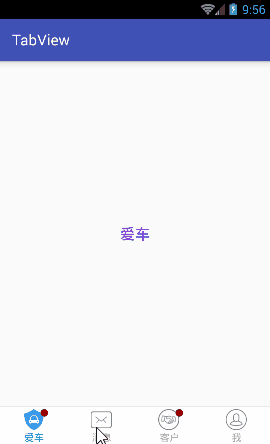

#a simple TabView Widget

##Usage
***

set tabView's property using attrs,using '|' to separate segments.

	<RelativeLayout xmlns:android="http://schemas.android.com/apk/res/android"
                xmlns:app="http://schemas.android.com/apk/res-auto"
                android:layout_width="match_parent"
                android:layout_height="match_parent">

	    <com.weiteng.tabview.TabView
	        android:id="@+id/tabview"
	        android:layout_width="match_parent"
	        android:layout_height="wrap_content"
	        android:layout_alignParentBottom="true"
	        android:background="@android:color/white"
	        app:tab_showNotice="true"
	        app:tab_texts="爱车|信息|合作|我"
	        app:tab_verticalGap="2dp"
	        app:tab_borderWidth="0.5dp"
	        android:paddingTop="4dp"
	        android:paddingBottom="4dp"
	        app:tab_textSize="13sp" />

	</RelativeLayout>

using setOnTabClickListener to listen to tab change event.

###Thanks
* [SHSegmentControl](https://github.com/7heaven/SHSegmentControl)